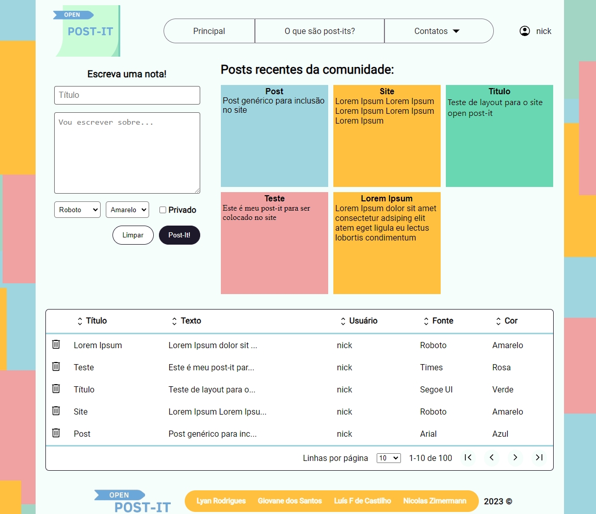

# Open-Post-It
Um site simples usando somente HTML, CSS e Javascript. O objetivo é criar um site no qual os usuários possam se cadastrar e publicar algum texto dentro de um post-it, o usuário poderá escolher se esse texto será público ou privado.

## Screenshots

 
 
 

## Requisitos

### Requisitos mínimos da interface gráfica (13/13): 
- [x] Conter cabeçalho com título
- [x] Conter menu com submenus presentes no topo da página ou na lateral esquerda (todos os menus deverão funcionar para alguma coisa presente em SUA PÁGINA INICIAL).
- [x] Conter um local que SIMBOLIZE que você está autenticado na página. Deve ficar no canto superior direito. Não será cadastrado usuário, somente simbólico (exemplo: nome de usuário fixo com foto fixa, como vemos no AVA ao fazer login).
- [x] Conter uma forma de realizar o CRUDL (inserir, alterar, excluir, mostrar os dados de um item e listar todos)
- [x] Conter rodapé com o nome de toda a equipe
- [x] Conter uma logo no canto superior esquerdo que redirecione para a home da página
- [x] Os menus devem ser feitos utilizando lista com itens
- [x] Deve-se utilizar HTML 5 semântico
- [x] A maior parte dos alinhamentos devem ser feitos com CSS externo
- [x] Deve-se utilizar classes para melhorar a visibilidade do CSS
- [x] Deve-se utilizar os atributos de acessibilidade para as tags do HTML
- [x] A página deve ser responsiva
- [x] Deve ser implementados todos os elementos solicitados e já aprovados no Trabalho 1.

### Requisitos de funcionalidades Javascript (9/9):
- [x] Ao clicar na logo, deve recarregar a homepage
- [x] Ao clicar no cadastrar/inserir do formulário, caso algum campo obrigatório esteja em branco ou preenchido com valor incorreto, deve-se apresentar uma mensagem adequada a situação
- [x] Ao clicar no cadastrar/inserir do formulário, caso os campos estejam corretos, deve-se adicionar uma linha na tabela com os dados conforme presentes nesse formulário
- [x] Ao clicar no botão de cancelar/limpar do formulário, a ação de limpa-lo deve ser realizada
- [x] Ao clicar no menu/submenu deve abrir a tela correspondente
- [x] Ao clicar em uma linha da tabela, deve-se permitir o usuário edita-la (pode-se carregar novamente os dados no formulário para edição)
- [x] Ao clicar em uma linha da tabela, deve-se permitir o usuário exclui-la
- [x] Ao realizar o login, deve-se fazer uma validação com login e senha fixos e só assim poderá ser acessado a segunda página. Caso a segunda página seja acessada diretamente, deve-se retornar ao login caso ainda não o tenha feito. Salvar dados de login na session.
- [x] Os dados da tabela devem ser armazenados no LocalStorage ou Cookies de modo que ao fechar a página e reabri-la as informações sejam mantidas.